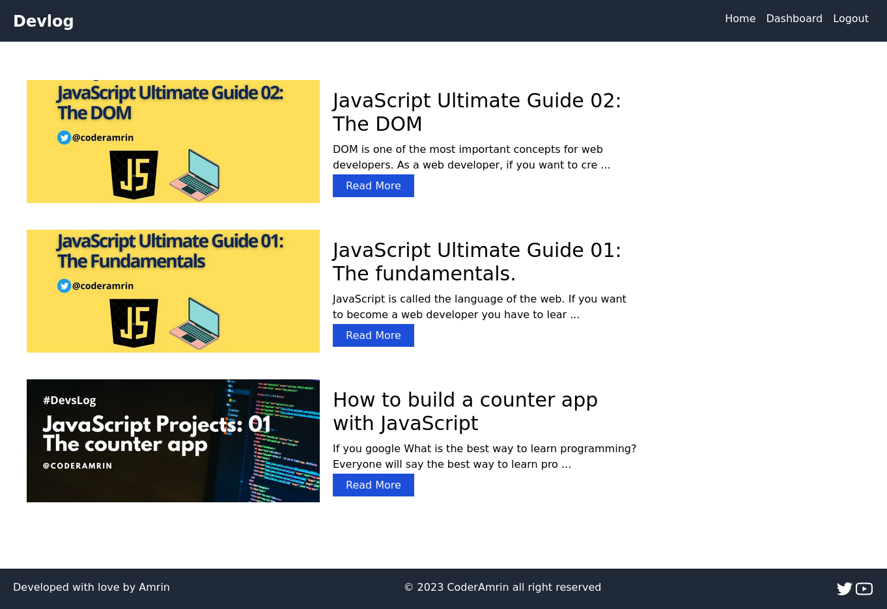
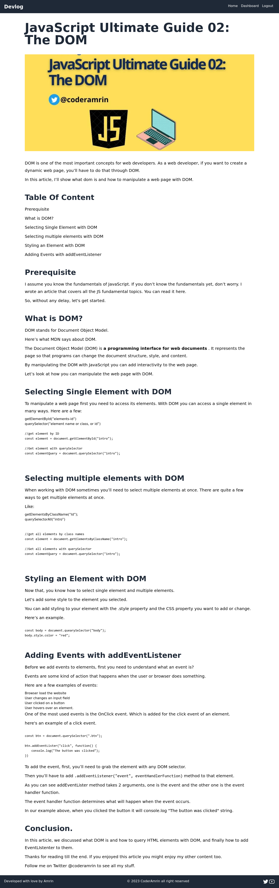
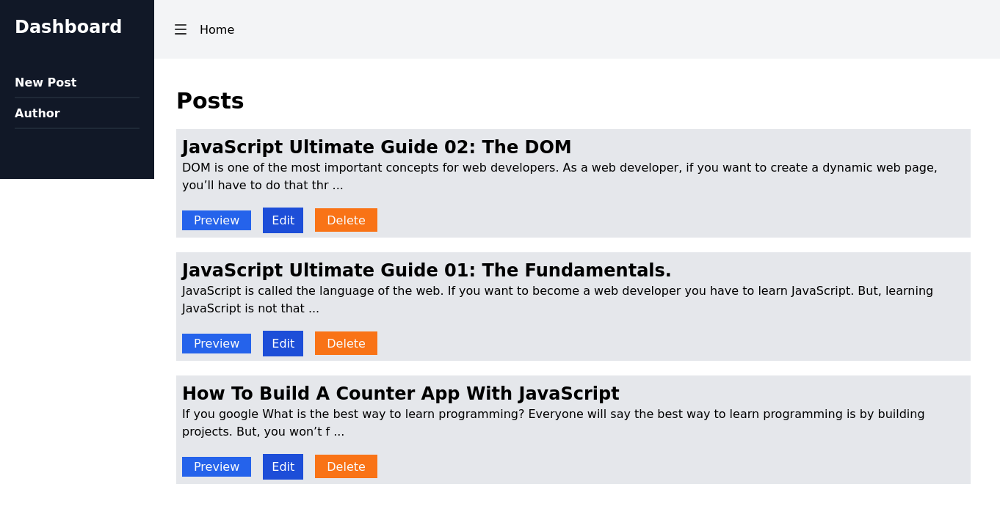

# devlog
Multi author blog application with MERN

### Live: https://devlogg.onrender.com/

## Technologies I used: 

### Frontend
1. React.js
2. Tailwind CSS

### Backend 
1. Node.js
2. Express js
3. MongoDB
4. JWT 

## Project Preview

